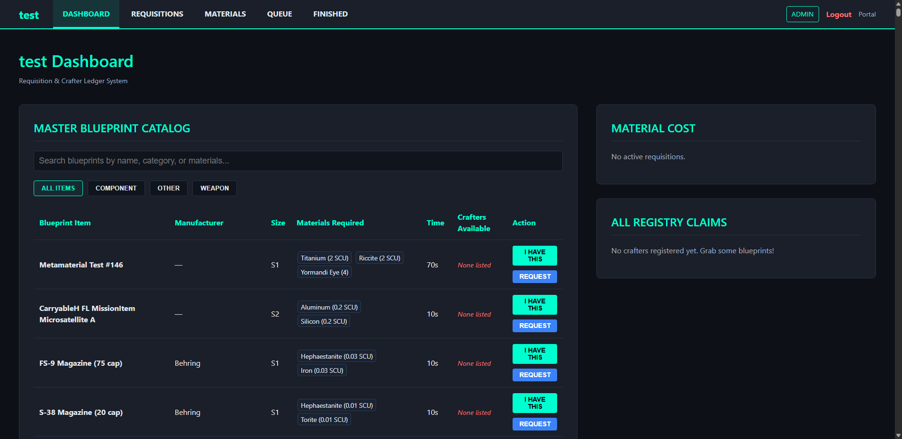
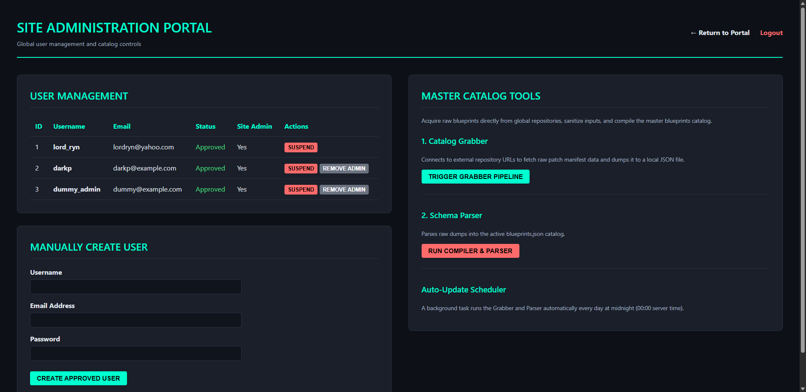

# **🛠️ Blueprint Compiler**


**Internal Documentation & Developer Guide**

This repository contains the source code for a Multi-Tenant Requisition & Crafter Ledger System (Blueprint Compiler). This application serves as an internal multi-tenant organizational tool to bridge the gap between members requiring specific items and the crafters who hold the necessary blueprints.

By decentralizing the "who can craft what" ledger, we reduce administrative overhead and streamline in-game logistics.

---

## **🏗️ Architecture & Technical Overview**

The application is built as a multi-tenant, role-based requisition management application with an automated web scraping data pipeline.

* **Multi-Tenant Organizations:** Users can register accounts, create organizations with unique URL slugs (e.g. `/org/my-org`), send requests to join existing organizations, and manage organization membership.
* **Role-Based Access Control (RBAC):** Organization members are assigned specific roles which dictate permissions:
  * `Admin`: Full control over org settings, membership approvals, role modifications, and ledger pruning.
  * `Manager`: Control over claims registry, active requisitions, crafting queue, and material inventory.
  * `Member`: Standard user; can submit claims ("I HAVE THIS"), make requisitions, check the crafting queue, and view catalog lists.
  * `Viewer`: Read-only observer.
* **Requisition & Crafting Pipeline:** Complete end-to-end management of organizational needs.
  * Members submit requisitions with context notes for requested blueprints.
  * Crafters use the system to automatically deduct the precise required grade of materials from the organization inventory.
  * Jobs are tracked via real-time timers and automatically processed by an active background task scheduler.
  * Finished items are queued for distribution to fulfill the original requisitions.
* **Global Site Administration:** A specialized portal designed for global control:
  * Manually approve or suspend new user accounts.
  * Grant global Site Admin privileges to other users.
  * Centrally manage the master blueprint catalog grabber.
* **Data Integration Pipeline:** An automated web scraper and parser system allows administrators to update the master catalog of items directly from scmdb.net:
  * **Grabber (`bp_catalog_grabber.py`):** Uses Selenium (Chrome headless driver) to download dynamic fabricator items from the web database, saving raw components to `blueprints unprocessed.txt`.
  * **Parser (`blueprint_parser.py`):** Parses raw HTML components using BeautifulSoup4, compiling names, categories, sizes, manufacturers, crafting times, and material quantities into `blueprints.json`.
  * **Automated Scheduler:** A background `Flask-APScheduler` task runs the Grabber and Parser nightly to keep the catalog fresh automatically.
* **Dynamic Claim Ledger (SQLite):** User details, tenant organizations, membership roles, claims, requisitions, inventory, and join requests are managed with `Flask-SQLAlchemy` and stored in `crafters.db`.
* **Visual Styling:** Styled using custom CSS variables (`--app-panel`, `--app-line`, and `--app-text`) for a sleek, modern UI.

## **📸 Interface Showcases**

### **Organization Dashboard & Ledger**

*Interactive ledgers where users can tag themselves as crafters, submit requisitions, check the real-time crafting queue, allocate materials, and track finished goods.*

### **Site Administration Portal**

*Centralized management for user account approvals, manual user creation, and controlling the background data catalog pipelines.*

---

## **🧰 Tech Stack**

* **Backend Core:** Python 3.8+, Flask, Flask-APScheduler
* **Database & ORM:** Flask-SQLAlchemy, SQLite (`crafters.db`)
* **Scraping & Parsing:** Selenium, BeautifulSoup4, webdriver-manager
* **Frontend:** HTML5, Jinja2 Templating, Vanilla JavaScript (ES6)
* **Styling:** CSS3 variables, flexbox, and grid layouts

---

## **📂 Project Structure**

```
Blueprint_Compiler/  
│  
├── app.py                  # Main Flask application, routing, scheduler, and tenant controllers
├── models.py               # Database models (User, Org, Role, Claims, Requisitions, Requests)
├── bp_catalog_grabber.py   # Selenium web scraper for scmdb.net fabricator catalog
├── blueprint_parser.py     # BeautifulSoup HTML card parser & database compiler
├── blueprints.json         # Master database of all parsed blueprints (active catalog)
├── blueprints unprocessed.txt # Raw HTML cards downloaded by catalog grabber
├── requirements.txt        # Python dependency manifest
├── instance/crafters.db    # Local SQLite database (Auto-generated on boot)
│  
├── assets/                 # Generated documentation imagery
│  
├── static/                   
│   └── styles.css          # Core stylesheets and visual variables  
│  
└── templates/              # Jinja2 frontend templates
    ├── portal.html         # User entry dashboard & organization gateway
    ├── login.html          # Authentication login portal
    ├── register.html       # Authentication registration portal
    ├── create_org.html     # Registration form for a new organization
    ├── dashboard.html      # Organization requisition and catalog panel
    ├── admin.html          # Admin panel (member roles, join requests)
    ├── site_admin.html     # Global site admin control panel
    ├── join.html           # Request form to join an organization
    ├── join_pending.html   # Status indicator for pending join requests
    └── join_req_modal.html # Helper widgets
```

---

## **🚀 Local Development Setup**

To run and test the compiler application locally:

### **1. Environment Setup**
Clone the repository and set up a Python virtual environment:
```bash
git clone https://github.com/lordryn/Blueprint_Compiler.git  
cd Blueprint_Compiler  
python -m venv .venv
```

Activate the virtual environment:
* **Windows (PowerShell):** `.venv\Scripts\Activate.ps1`
* **Windows (CMD):** `.venv\Scripts\activate.bat`
* **Mac/Linux:** `source .venv/bin/activate`

### **2. Install Dependencies**
```bash
pip install -r requirements.txt
```

### **3. Run Flask Server**
```bash
python app.py
```
The application will boot on **http://127.0.0.1:5000**.
*Note: On initial boot, the application will automatically initialize the database schema and default roles inside `instance/crafters.db`. The very first registered user is automatically granted Site Admin privileges.*

---

## **⚙️ Catalog Sync Operations (Grabber & Parser)**

Administrators can update the master `blueprints.json` database manually or rely on the automated nightly cron jobs.

### **Method A: From Site Admin UI**
1. Navigate to `/site-admin`.
2. Click **TRIGGER GRABBER PIPELINE** to start the Selenium runner and scrape scmdb.net.
3. Click **RUN COMPILER & PARSER** to trigger the BeautifulSoup parser and update `blueprints.json`.

### **Method B: From CLI**
Run the scripts sequentially inside your virtual environment:
```bash
# Scrape scmdb.net web cards
python bp_catalog_grabber.py

# Parse HTML cards into blueprints.json database
python blueprint_parser.py
```

---

## **🔒 Production & Deployment Notes**

Before deploying this to your live production infrastructure:

1. **Secret Key Management:** Ensure `SECRET_KEY` is loaded securely from the environment using `os.environ.get('SECRET_KEY')`.
2. **Database Migrations:** When updating the `models.py` schema, the SQLite `instance/crafters.db` must be migrated or reset.
3. **WSGI Server:** Bind the application using a production WSGI server (e.g., `gunicorn` or `waitress`) instead of the default Werkzeug runner.
4. **Cloudflare Tunneling:** The app runs locally on port 5000 and is designed to sit behind a `cloudflared` reverse proxy or reverse proxy server (NGINX/Apache) terminating SSL. 

---

*Open Source Community Edition* 🚀
